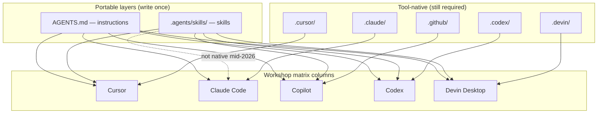

# feat: .agents/ folder as partial cross-tool compatibility layer

## Overview

Research whether a unified `.agents/` directory convention can simplify or replace the workshop's five-column `ToolMatrix` slides. **Finding:** `.agents/` is real but **partial** — it is an emerging cross-tool convention for **skills only**, not a full compatibility layer for instructions, custom agents, MCP, or orchestration. The workshop should adopt a **hybrid narrative**: teach `.agents/skills/` and `AGENTS.md` as the two portable layers, keep per-tool matrix columns for everything else, and do **not** collapse the matrix into a single `.agents/` row.

This plan covers **workshop content updates only** (slides, matrix rows, facilitator copy). No application code beyond content verification.

**Builds on:** [2026-06-19-001-refactor-capability-first-workshop-structure-plan.md](./2026-06-19-001-refactor-capability-first-workshop-structure-plan.md) (implemented on branch `refactor/capability-first-workshop-structure`).

## Problem Frame

The capability-first refactor (plan 001) solved Copilot-centrism by teaching concepts first and mapping them across five tools via `ToolMatrix` + `src/components/toolMatrixRows.ts`. Attendees still face cognitive load: five columns × multiple capability rows. The user hypothesis is that a unified `.agents/` folder might reduce that surface area.

**Reality check:** Two different "agent" conventions exist in the ecosystem and must not be conflated in slides:

| Convention | What it is | Scope |
|---|---|---|
| **`AGENTS.md`** (file) | Open, vendor-neutral project instructions ("README for agents") | Instructions / rules text |
| **`.agents/skills/`** (folder) | De facto cross-tool skills directory tied to the Agent Skills open standard | Skills only (`SKILL.md` bundles) |
| **`.cursor/`, `.claude/`, `.github/`, `.codex/`, `.devin/`** | Tool-native config trees | Agents, rules, MCP, tool-specific features |

`.agents/` is **not** a replacement for `AGENTS.md`, and `AGENTS.md` is **not** a folder — the Instructions section already teaches the file correctly.

## Requirements Trace

- **R1 (from origin R4/R6):** Cross-tool comparison matrices remain the primary teaching device per capability section.
- **R2 (research):** Document verified `.agents/` support per tool with official URLs — no invented paths.
- **R3 (user goal):** Answer whether `.agents/` is full or partial cross-tool compatibility.
- **R4 (user goal):** Recommend workshop narrative change (if any).
- **R5 (user goal):** Decide whether `toolMatrixRows.ts` should lead with a `.agents/` row.
- **R6 (origin scope):** Secondary tools (Codex, Devin Desktop) stay lighter columns; gaps noted briefly, not speculated.
- **R7 (origin R3):** Instructions section keeps `AGENTS.md` as the cross-tool instructions convention — do not subsume into `.agents/` folder framing.

## Scope Boundaries

- **In scope:** Agents & Skills section narrative, optional Instructions cross-link, `toolMatrixRows.ts` skills row refinement, facilitator footnotes, README matrix summary if needed.
- **Out of scope:** Building sync/compile tooling, changing `ToolMatrix` component API, replacing all matrix slides with one `.agents/` slide, renaming vendor folders in attendee repos.
- **Not a goal:** Claiming feature parity where tools only partially read `.agents/` (especially Claude Code skills).
- **Deferred:** `.agents/rules/` as a future standard — Cursor feature request only, not shipped.

## Context & Research

### What is `.agents/` today?

**Classification:** Emerging **de facto convention** for skills discovery — not a formal multi-capability standard like `AGENTS.md`.

**Provenance chain:**

1. **Agent Skills format** — open standard for `SKILL.md` bundles; originated by Anthropic, maintained at [agentskills.io](https://agentskills.io/specification). Specifies skill *format*, not a mandatory install path.
2. **`.agents/skills/` path** — adopted by OpenAI Codex as primary repo skills location ([Codex skills docs](https://developers.openai.com/codex/skills)).
3. **Vercel `npx skills` CLI** ([vercel-labs/skills](https://github.com/vercel-labs/skills)) — uses `.agents/skills/` as the canonical project path for many agents; symlinks/copies to tool-native paths where needed (e.g. Claude → `.claude/skills/`).
4. **Multi-vendor alignment** — Cursor, GitHub Copilot, and Devin Desktop added `.agents/skills/` as an *additional* discovery path alongside native folders.

**Distinct from `AGENTS.md`:** The [agents.md](https://agents.md/) project (OpenAI Codex, Cursor, Factory, Jules, and others) defines a **root markdown file** for instructions. Stewardship moved toward the Agentic AI Foundation / Linux Foundation ecosystem. 60k+ OSS repos use root `AGENTS.md`. Nested `AGENTS.md` files scope instructions by directory — same *filename*, not `.agents/` folder.

### Per-tool `.agents/` support (verified mid-2026)

#### Skills — `.agents/skills/*/SKILL.md`

| Tool | Reads `.agents/skills/`? | Primary native path | Global path | Official source |
|---|---|---|---|---|
| **OpenAI Codex** | **Yes** (primary) | `.agents/skills/` | `~/.agents/skills/` | [developers.openai.com/codex/skills](https://developers.openai.com/codex/skills) |
| **Cursor** | **Yes** (alongside native) | `.agents/skills/` **or** `.cursor/skills/` | `~/.cursor/skills/` (note: `~/.agents/skills/` support reported inconsistently in forum threads) | [cursor.com/docs/skills](https://cursor.com/docs/skills) |
| **GitHub Copilot** | **Yes** (alongside native) | `.agents/skills/`, `.github/skills/`, `.claude/skills/` | `~/.agents/skills/` or `~/.copilot/skills/` | [docs.github.com/.../about-agent-skills](https://docs.github.com/en/copilot/concepts/agents/about-agent-skills) |
| **Devin Desktop** | **Yes** (cross-agent compat) | `.devin/skills/` (preferred write path) | `~/.codeium/windsurf/skills/` (legacy global) | [docs.devin.ai/desktop/cascade/skills](https://docs.devin.ai/desktop/cascade/skills) |
| **Claude Code** | **No** (native only) | `.claude/skills/` | `~/.claude/skills/` | [code.claude.com/docs/en/skills](https://code.claude.com/docs/en/skills) |

**`npx skills` install targets** (CLI maps canonical → native):

| Agent | Project path written by CLI | Source |
|---|---|---|
| Codex | `.agents/skills/` | [vercel-labs/skills supported agents table](https://github.com/vercel-labs/skills#supported-agents) |
| Cursor | `.agents/skills/` | same |
| GitHub Copilot | `.agents/skills/` | same |
| Claude Code | `.claude/skills/` | same |
| Devin | `.devin/skills/` | same |

#### Custom agents — no `.agents/agents/` standard

| Tool | Path | Format |
|---|---|---|
| Cursor | `.cursor/agents/*.md` | Markdown + frontmatter |
| Claude Code | `.claude/agents/*.md` | Markdown + frontmatter |
| GitHub Copilot | `.github/agents/*.md` | Markdown + frontmatter |
| Codex | `.codex/agents/*.toml` | TOML (not markdown) |
| Devin Desktop | `.devin/agents/<name>/AGENT.md` | Nested folder |

No official documentation found for `.agents/agents/`.

#### Rules / instructions — no `.agents/rules/` standard (yet)

| Tool | Project-wide rules | Scoped rules |
|---|---|---|
| Cursor | `.cursor/rules/*.mdc` or `AGENTS.md` | `.cursor/rules/` globs |
| Claude Code | `CLAUDE.md`, `AGENTS.md` | `.claude/rules/*.md` |
| Copilot | `.github/copilot-instructions.md` | `.github/instructions/*.instructions.md` |
| Codex | `AGENTS.md` | Nested `AGENTS.md` |
| Devin | `.devin/rules/*.md` or `AGENTS.md` | `.devin/rules/` globs |

**`.agents/rules/`:** [Cursor community feature request](https://forum.cursor.com/t/support-agents-rules-as-a-project-level-rules-directory-parity-with-agents-skills/163385) only — not in Cursor official docs. **Do not teach as current.**

#### MCP — tool-specific only

No `.agents/mcp.json` or equivalent found. Paths remain `.cursor/mcp.json`, `.mcp.json`, `.vscode/mcp.json`, `.codex/config.toml`, `.devin/config.json` (per plan 001).

#### Codex-only: `agents/openai.yaml`

Optional skill sidecar inside a skill folder for Codex app UI metadata and invocation policy ([Codex skills docs](https://developers.openai.com/codex/skills)). Not cross-tool.

### Overlap with existing workshop paths

Current `toolMatrixRows.ts` state:

- **Skills row:** Codex alone shows `.agents/skills/*/SKILL.md`; other columns show native paths only.
- **Instructions matrix:** `AGENTS.md` row under "Cross-tool convention" — correct and separate from `.agents/` folder.
- **No `.agents/` folder** exists in this repo; workshop teaches paths, not a live example tree.

**Conceptual stack to teach:**

```
Layer 1 — Instructions (always-on):     AGENTS.md (+ tool-native rules files)
Layer 2 — Skills (on-demand):            .agents/skills/  ← portable where supported
Layer 3 — Tool-native extensions:        .cursor/, .claude/, .github/, .codex/, .devin/
```

### Relevant Code and Patterns

- Matrix data: `src/components/toolMatrixRows.ts` — `agentsMatrixRows` skills row (line ~70–78) is the only `.agents/` reference today.
- Matrix UI: `src/components/ToolMatrix.tsx`, `STANDARD_TOOL_COLUMNS` (Cursor, Claude, Copilot primary; Codex, Devin secondary).
- Agents section: `src/sections/agents.tsx` — matrix slide at "Agents & Skills by Tool".
- Instructions section: `src/sections/instructions.tsx` — dedicated `AGENTS.md` slides (~387+); concept-first matrix already present.
- Prior plan matrix scope: plan 001 § Matrix Slide Scope — do not remove per-capability matrices.

### Institutional Learnings

- No matching entries in `docs/solutions/`.

### External References

- Agent Skills specification: https://agentskills.io/specification
- AGENTS.md open format: https://agents.md/
- Codex skills (`.agents/skills/`): https://developers.openai.com/codex/skills
- Cursor skills directories: https://cursor.com/docs/skills
- GitHub Copilot agent skills: https://docs.github.com/en/copilot/concepts/agents/about-agent-skills
- Copilot customization cheat sheet: https://docs.github.com/en/copilot/reference/customization-cheat-sheet
- Devin Desktop skills (cross-agent): https://docs.devin.ai/desktop/cascade/skills
- Claude Code skills (native path only): https://code.claude.com/docs/en/skills
- Vercel skills CLI: https://github.com/vercel-labs/skills
- Claude Code `.agents/skills/` feature request: https://github.com/anthropics/claude-code/issues/66352

## Key Technical Decisions

- **Compatibility verdict:** `.agents/` is **partial** cross-tool compatibility — **skills only**, with Claude Code as the primary gap (native `.claude/skills/` only; community demand for `.agents/` not yet shipped).
- **Do not replace the five-column matrix.** Matrices remain essential for agents, rules, MCP, orchestration, and tool-specific formats (Codex TOML, Copilot runtime subagents, Devin ACC).
- **Recommended narrative:** Add **one teaching slide** in Agents & Skills (after title, before or after existing matrix) explaining the **two portable layers** (`AGENTS.md` + `.agents/skills/`) vs **tool-native trees** — not a new top-level section.
- **`toolMatrixRows.ts` change:** **Do not** add a matrix row that leads with `.agents/` for all capabilities. **Do** refine the **Skills** row to show portable path where verified, with Claude explicitly on `.claude/skills/` and a footnote that `npx skills` may symlink/copy across paths.
- **Hybrid matrix pattern for Skills row:**

| Concept | Cursor | Claude | Copilot | Codex | Devin |
|---|---|---|---|---|---|
| Skills (native) | `.cursor/skills/` | `.claude/skills/` | `.github/skills/` | `.agents/skills/` | `.devin/skills/` |
| Skills (portable) | `.agents/skills/` ✓ | — (use native or symlink) | `.agents/skills/` ✓ | `.agents/skills/` ✓ | `.agents/skills/` ✓ |

  Prefer a **single Skills row** with cell text like `.agents/skills/` (+ native fallback note in footnote) rather than doubling row count — stay under 6 rows per slide (plan 001 limit).

- **Callout slide title (proposed):** "Two Portable Layers" — `AGENTS.md` for instructions, `.agents/skills/` for skills; everything else stays tool-native.
- **Facilitator honesty:** Label Claude Code `.agents/skills/` gap as "as of mid-2026 — use `.claude/skills/` or `npx skills` symlink"; mention Cursor global-path asymmetry (`~/.cursor/skills/` vs project `.agents/skills/`).

## Open Questions

### Resolved During Planning

- **Is `.agents/` real cross-tool compatibility?** Partial — skills subdirectory only; instructions use `AGENTS.md` file; agents/MCP remain vendor paths.
- **Who proposed it?** Agent Skills format: Anthropic → open standard. `.agents/skills/` path: Codex + ecosystem adoption via `npx skills` CLI and multi-vendor discovery paths.
- **Replace 5-column matrix?** No.
- **Lead `toolMatrixRows.ts` with `.agents/` row?** No — refine Skills row + add one explainer slide instead.
- **Devin and `.agents/`?** Devin reads `.agents/skills/` for compatibility but writes/prefer `.devin/skills/` — teach both in footnote, not as primary cell for Devin column.

### Deferred to Implementation

- Exact footnote wording length on matrix slide (viewport fit vs completeness).
- Whether to add a brief `npx skills add` demo bullet on the explainer slide (facilitator time budget).
- Whether Instructions section needs a one-line forward reference to `.agents/skills/` slide in Agents section (likely yes — single sentence on existing AGENTS.md slide).
- Cursor `~/.agents/skills/` global support — forum reports mixed; verify against latest Cursor docs at implementation time before asserting in slides.

## High-Level Technical Design

> *This illustrates the intended teaching model and is directional guidance for review, not implementation specification.*



## Implementation Units

- [ ] **Unit 1: Content audit and path verification**

**Goal:** Confirm all `.agents/` claims in new copy against official docs before slide edits.

**Requirements:** R2, R6

**Dependencies:** None

**Files:**
- Modify: `docs/plans/2026-06-19-002-feat-agents-folder-compatibility-beta-plan.md` (check off verification notes if paths drift)
- Reference: `src/components/toolMatrixRows.ts`

**Approach:**
- Re-fetch Cursor skills, Copilot about-agent-skills, Codex skills, Devin cascade/skills, Claude skills docs.
- Record "as of YYYY-MM" date in slide footnote template.
- Flag any doc regression (e.g. Claude adds `.agents/skills/` support) for matrix update.

**Test scenarios:**
- Each tool column in Skills row has an official doc URL backing the path.
- Claude column does not claim native `.agents/skills/` unless docs change.

**Verification:**
- Facilitator source list attached to PR; no path appears in slides without a doc link.

---

- [ ] **Unit 2: Add "Two Portable Layers" explainer slide**

**Goal:** Teach `.agents/skills/` + `AGENTS.md` as complementary portable layers without displacing the matrix.

**Requirements:** R3, R4, R7

**Dependencies:** Unit 1

**Files:**
- Modify: `src/sections/agents.tsx`
- Reference: `src/sections/instructions.tsx` (AGENTS.md slides for cross-link consistency)

**Approach:**
- Insert one slide after section title slide, before "Agents & Skills by Tool" matrix.
- Three-tier visual: (1) `AGENTS.md` — instructions, (2) `.agents/skills/` — portable skills, (3) tool-native folders — agents, rules, MCP.
- Explicit anti-pattern callout: "Don't put instructions in `.agents/` — use `AGENTS.md`."
- One bullet on `npx skills add` as ecosystem installer (optional demo).
- Net slide count: +1 in Agents section; acceptable per plan 001 if overall main path stays ≤122.

**Patterns to follow:**
- Callout box style from existing matrix slides (`bg-purple-50`, border-l-4).
- Concept-first prose in `instructions.tsx` "Custom Instructions" slide.

**Test scenarios:**
- Attendee can state which layer owns skills vs instructions.
- Attendee does not conflate `.agents/` folder with `AGENTS.md` file.

**Verification:**
- Slide renders in `npm run build`; no vendor-named section added.

---

- [ ] **Unit 3: Refine Skills row in toolMatrixRows**

**Goal:** Surface portable `.agents/skills/` path across matrix columns where verified, without a misleading universal row.

**Requirements:** R1, R5, R6

**Dependencies:** Unit 1

**Files:**
- Modify: `src/components/toolMatrixRows.ts` (`agentsMatrixRows` Skills row)
- Modify: `src/sections/agents.tsx` (matrix footnote if not in Unit 2)

**Approach:**
- Update Skills cells:
  - **Cursor, Copilot, Codex, Devin:** mention `.agents/skills/*/SKILL.md` as portable path (Codex: already correct; align others).
  - **Claude:** keep `.claude/skills/*/SKILL.md`; do not show `.agents/skills/` as native.
- Add matrix footnote: "`npx skills` installs to `.agents/skills/` for Copilot/Cursor/Codex; Claude gets `.claude/skills/` copy/symlink."
- **Do not** add separate "Portable skills" row if it pushes slide past 6 rows — prefer footnote + explainer slide.

**Patterns to follow:**
- Existing cell `kind: 'code'` monospace paths in `toolMatrixRows.ts`.
- Plan 001 verified paths table for agents matrix.

**Test scenarios:**
- Claude column does not imply `.agents/skills/` native support.
- Codex column remains accurate (`.agents/skills/` primary).

**Verification:**
- `agentsMatrixRows` renders correctly in ToolMatrix on mobile row-cards and desktop table.

---

- [ ] **Unit 4: Cross-link Instructions ↔ Agents sections**

**Goal:** Connect existing `AGENTS.md` teaching to new `.agents/skills/` slide without duplicating full AGENTS.md content.

**Requirements:** R7, R4

**Dependencies:** Unit 2

**Files:**
- Modify: `src/sections/instructions.tsx` (AGENTS.md slide or "Where Do I Put Instructions?" callout)
- Modify: `src/sections/agents.tsx` (forward reference back to Instructions)

**Approach:**
- On Instructions AGENTS.md slide: add one line — "For portable **skills** (not instructions), see Agents & Skills → Two Portable Layers."
- On Agents explainer slide: mirror — "For portable **instructions**, see Instructions → AGENTS.md."
- Do not merge sections; boundary stays Instructions = persistent guidance, Agents = agents/skills/delegation.

**Test scenarios:**
- Navigation labels unchanged (capability-first sidebar from plan 001).
- No duplicate AGENTS.md explainer slides in Agents section.

**Verification:**
- Both cross-links use section names matching `main.tsx` sidebar labels.

---

- [ ] **Unit 5: Facilitator gaps and README alignment**

**Goal:** Document known gaps, risks, and "as of" dating for facilitators; keep README accurate.

**Requirements:** R2, R6

**Dependencies:** Units 2–4

**Files:**
- Modify: `README.md` (section table — only if Agents slide count or description changes)
- Modify: `public/llms-full.txt` (if it summarizes matrix paths — align skills portable path wording)
- Optional: footnote only in slide JSX (no new doc file unless user requests)

**Approach:**
- README: no structural change unless slide inventory section lists Agents & Skills.
- `llms-full.txt`: replace any implication that `.agents/` covers all capabilities; state skills-only portability.
- Facilitator callouts (in slide footnotes):
  - Claude Code: no native `.agents/skills/` (GitHub issue #66352)
  - Cursor: project `.agents/skills/` yes; global path prefers `~/.cursor/skills/`
  - Devin: reads `.agents/skills/`, prefers `.devin/skills/` for writes
  - Copilot subagents: runtime-only (unchanged from plan 001)

**Test scenarios:**
- README section order still matches `main.tsx`.
- llms-full.txt does not over-promise cross-tool agent file portability.

**Verification:**
- Grep `llms-full.txt` for `.agents` — wording matches research verdict.

## System-Wide Impact

- **Slide indices:** +1 slide in Agents section shifts subsequent section start indices by 1; document in PR (same pattern as plan 001 Copilot removal index map).
- **Matrix maintenance:** `toolMatrixRows.ts` remains single source of truth for matrix cells; explainer slide must not hardcode paths that diverge from rows file.
- **No ToolMatrix API changes:** Component unchanged.
- **Attendee mental model:** Reduces "five folders" confusion for skills only; matrices still required for full picture.

## Risks & Dependencies

| Risk | Mitigation |
|---|---|
| Claude ships `.agents/skills/` support | Re-run Unit 1 path audit; update Claude matrix cell |
| Over-selling `.agents/` as full compatibility | Explainer slide + footnotes explicitly scope to skills |
| Matrix slide density | Single Skills row update + footnote, not extra row |
| `npx skills` CLI path table changes | Link to vercel-labs/skills repo, not hardcode all 68 agents |
| Cursor global `.agents/skills/` bugs | Teach project-level path; note forum workarounds briefly |

**Prerequisite:** Plan 001 capability-first structure merged or present on branch (already implemented per git status).

## Documentation / Operational Notes

- Date all portable-path claims "as of mid-2026" in slide footnotes.
- PR description should include: research verdict (partial), +1 slide delta, index shift note.
- Do not add `.agents/` example folder to workshop repo unless explicitly requested (teaching paths ≠ dogfooding).

## Alternative Approaches Considered

| Approach | Verdict |
|---|---|
| Replace all matrices with one `.agents/` slide | **Rejected** — false completeness; agents/MCP/rules stay vendor-specific |
| `.agents/` as new top-level sidebar section | **Rejected** — violates capability-first axis (plan 001 R2/R8) |
| Symlink-only teaching (no matrix change) | **Rejected** — too tool-specific for workshop; footnote only is insufficient |
| Wait for `.agents/rules/` standard | **Deferred** — feature request stage only |

## Success Metrics

- Facilitator dry-run: attendee correctly answers "where do portable skills go?" → `.agents/skills/` (with Claude exception).
- Facilitator dry-run: attendee correctly answers "where do cross-tool instructions go?" → `AGENTS.md` (not `.agents/`).
- No regression in plan 001 acceptance criteria (capability-first navigation, matrix per section).
- Main-path slide count remains ≤123 (+1 from explainer).

## Sources & References

- **Origin document:** [docs/brainstorms/2026-06-19-capability-first-tool-structure-requirements.md](../brainstorms/2026-06-19-capability-first-tool-structure-requirements.md)
- **Prior plan:** [docs/plans/2026-06-19-001-refactor-capability-first-workshop-structure-plan.md](./2026-06-19-001-refactor-capability-first-workshop-structure-plan.md)
- **Workshop matrix data:** `src/components/toolMatrixRows.ts`
- **Agents section:** `src/sections/agents.tsx`
- **Instructions section:** `src/sections/instructions.tsx`
